# Crispy Lechon House — Lechon Ordering System

> **Disclaimer:** This is a portfolio demonstration project. It uses a **fictional brand** ("Crispy Lechon House"), **placeholder assets**, and a **simulated payment gateway**. No real payments are processed, and no real business data is stored.

A full-stack **MERN** web application for ordering whole roasted lechon (Filipino-style pig) and party trays. Supports customer ordering with scheduled delivery/pick-up, a persistent shopping cart, simulated online checkout, an admin dashboard for order management and reporting, and a dine-in reservation system.

---

## Table of Contents

1. [System Architecture](#1-system-architecture)
2. [Tech Stack](#2-tech-stack)
3. [Project Structure](#3-project-structure)
4. [Data Models & Schema](#4-data-models--schema)
5. [Entity-Relationship Diagram](#5-entity-relationship-diagram)
6. [API Reference](#6-api-reference)
7. [Authentication & Authorization](#7-authentication--authorization)
8. [Data Flow Diagrams](#8-data-flow-diagrams)
9. [Features](#9-features)
10. [Quick Start](#10-quick-start)
11. [Environment Variables](#11-environment-variables)
12. [Deployment](#12-deployment)
13. [Accessibility](#13-accessibility)
14. [Screenshots](#14-screenshots)
15. [Testing](#15-testing)

---

## 1. System Architecture

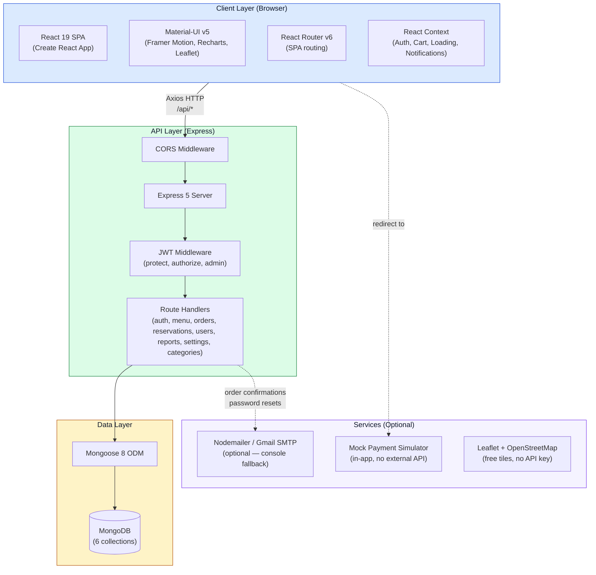

### Deployment Architecture

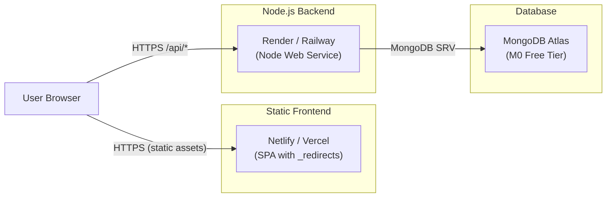

---

## 2. Tech Stack

### Frontend

| Category | Technology | Version | Purpose |
|---|---|---|---|
| Framework | React | 19.2 | UI library |
| Build Tool | Create React App (react-scripts) | 5.0.1 | Webpack dev server + production builds |
| UI Library | Material-UI (MUI) | 5.16 | Prebuilt components + theming |
| CSS-in-JS | Emotion | 11.13 | Scoped styles, `sx` prop |
| Routing | React Router DOM | 6.25 | Client-side SPA routing |
| State Mgmt | React Context + useReducer | — | Auth, Cart, CartSidebar, Loading, Notification, Modal |
| HTTP Client | Axios | 1.13 | Promise API with interceptors (JWT injection) |
| Animations | Framer Motion | 11.3 | Drag carousel, stagger lists, page transitions |
| Charts | Recharts | 3.4 | Admin dashboard analytics |
| Maps | Leaflet + React-Leaflet | 1.9 / 5.0 | Store location picker + delivery distance calc (OpenStreetMap free tiles) |
| PDF Export | jsPDF + jsPDF-AutoTable | 3.0 | Sales report generation |
| Date Helpers | date-fns | 4.1 | Date formatting, schedule validation |

### Backend

| Category | Technology | Version | Purpose |
|---|---|---|---|
| Runtime | Node.js (CommonJS) | — | Server-side JavaScript |
| Framework | Express | 5.1 | HTTP routing + middleware |
| Database ODM | Mongoose | 8.19 | MongoDB object modeling, schema validation |
| Auth | jsonwebtoken + bcryptjs | 9.0 / 3.0 | JWT signing + password hashing |
| Email | Nodemailer | 7.0 | Transactional emails (optional) — falls back to `console.log` when unconfigured |
| Dev | Nodemon | 3.1 | Auto-restart on file changes |

### Third-party Services (external)

| Service | Key required? | Used? | Notes |
|---|---|---|---|
| MongoDB Atlas | Yes (connection URI) | Required | Free M0 tier available (512 MB) |
| Gmail SMTP | No (optional) | Optional | Falls back to console logging when env vars absent |
| OpenStreetMap | No | Yes | Leaflet tile server — completely free, no API key |
| PayMongo | **Removed** | No | Mock payment simulator used instead |
| Cloudinary | **Removed** | No | Images stored locally as SVG placeholders |

---

## 3. Project Structure

```
lechon-ordering-app/
├── README.md                         ← This file
├── revision-plan.md                  ← Portfolio conversion plan
├── package.json                      ← Root: concurrently scripts
│
├── client/                           ← React SPA (port 3000)
│   ├── package.json
│   ├── .env.example
│   ├── public/
│   │   ├── index.html                ← HTML shell, meta tags, <title>
│   │   ├── _redirects                ← Netlify SPA fallback
│   │   ├── manifest.json             ← PWA manifest
│   │   ├── images/                   ← SVG placeholder assets
│   │   │   ├── logo.svg
│   │   │   ├── hero.svg
│   │   │   ├── contact.svg
│   │   │   └── menu-page-*.svg
│   │   └── robots.txt
│   └── src/
│       ├── index.js                  ← ReactDOM entry
│       ├── App.js                    ← Route definitions (customer + admin)
│       ├── theme.js                  ← MUI theme (palette, typography, overrides)
│       ├── api.js                    ← Axios instance + JWT interceptor
│       │
│       ├── config/
│       │   └── branding.js           ← Centralized brand strings + contact info
│       │
│       ├── context/                  ← React Context providers
│       │   ├── AuthContext.js        ← Login, register, logout, profile update
│       │   ├── CartContext.js        ← Add/remove items, persistent cart sync
│       │   ├── CartSidebarContext.js ← Floating cart drawer toggle
│       │   ├── LoadingContext.js     ← Global loading overlay
│       │   ├── ModalContext.js       ← Global modal (confirmations)
│       │   └── NotificationContext.js← Toast notifications
│       │
│       ├── components/               ← Shared UI components
│       │   ├── MainLayout.js         ← Customer layout (navbar, footer, skip-link)
│       │   ├── AdminLayout.js        ← Admin layout (sidebar, header)
│       │   ├── Navbar.js             ← Responsive nav (desktop + mobile drawer)
│       │   ├── Footer.js             ← Copyright, Terms, Privacy modals
│       │   ├── CartDrawer.js         ← Slide-out cart sidebar
│       │   ├── FloatingCartButton.js ← FAB with badge
│       │   ├── PlaceholderImage.js   ← On-brand SVG fallback for missing images
│       │   ├── LechonSpinner.js      ← Branded loading spinner
│       │   ├── LoadingOverlay.js     ← Full-screen loader
│       │   └── GlobalModal.js        ← Reusable confirmation dialog
│       │
│       └── pages/
│           ├── HomePage.js           ← Hero, menu grids, dine-in carousel, contact
│           ├── MenuPage.js           ← Filterable a-la-carte menu
│           ├── LechonPage.js         ← Whole lechon listings with detail view
│           ├── CartPage.js           ← Full cart with quantity adjustment
│           ├── CheckoutPage.js       ← Order type, delivery, payment, terms
│           ├── MockPaymentPage.js    ← Simulated payment gateway
│           ├── LoginPage.js
│           ├── RegisterPage.js
│           ├── ProfilePage.js        ← Update profile, change email
│           ├── OrdersPage.js         ← User's order history + status tracking
│           ├── OrderDetailPage.js    ← Single order with payment verification
│           ├── ResetPasswordPage.js
│           └── admin/
│               ├── DashboardPage.js      ← Metrics, charts (Recharts)
│               ├── OrderListPage.js      ← Filterable order table
│               ├── AdminOrderDetailPage.js← Order detail with status management
│               ├── MenuListPage.js       ← CRUD menu items (FileReader upload)
│               ├── LechonListPage.js     ← CRUD lechon items
│               ├── CategoryListPage.js   ← CRUD categories
│               ├── UserListPage.js       ← User management
│               ├── ReportsPage.js        ← Sales reports + PDF export (jsPDF)
│               └── SettingsPage.js       ← Global config (tax, delivery fees, map)
│
└── server/                           ← Express API (port 8080)
    ├── package.json
    ├── .env.example
    ├── server.js                     ← Entry: middleware, routes, listen
    │
    ├── config/
    │   ├── db.js                     ← Mongoose connection (process.env.MONGODB_URI)
    │   └── branding.js               ← Server-side brand strings for emails
    │
    ├── models/
    │   ├── userModel.js              ← User + Address + CartItem sub-schemas
    │   ├── menuItemModel.js          ← Menu items (name, price, category, imageUrl, etc.)
    │   ├── categoryModel.js          ← Categories (name only)
    │   ├── orderModel.js             ← Orders (items, delivery, payment, status)
    │   ├── reservationModel.js       ← Dine-in / Lechon reservations
    │   └── settingModel.js           ← App-wide settings (tax, delivery fees, location)
    │
    ├── middleware/
    │   └── authMiddleware.js         ← protect, admin, authorize (JWT)
    │
    ├── controllers/
    │   ├── authController.js         ← register, login
    │   ├── userController.js         ← profile, cart, password reset, email change
    │   ├── menuItemController.js     ← CRUD menu items
    │   ├── categoryController.js     ← CRUD categories
    │   ├── orderController.js        ← create, verify, status, cancel
    │   ├── reservationController.js  ← create, status management
    │   ├── reportsController.js      ← Sales/reservation summaries
    │   └── settingController.js      ← Get/update global config
    │
    ├── routes/
    │   ├── authRoutes.js
    │   ├── userRoutes.js
    │   ├── menuRoutes.js
    │   ├── categoryRoutes.js
    │   ├── orderRoutes.js
    │   ├── reservationRoutes.js
    │   ├── reportsRoutes.js
    │   └── settingRoutes.js
    │
    ├── utils/
    │   ├── generateToken.js          ← JWT sign(id, role, 30d expiry)
    │   └── sendEmail.js              ← Nodemailer or console fallback
    │
    ├── seeder.js                     ← Seed sample menu items
    └── seedLechon.js                 ← Seed lechon product catalog
```

---

## 4. Data Models & Schema

### 4.1 User

```
User
├── _id                 : ObjectId (PK)
├── name                : String (required)
├── email               : String (required, unique)
├── password            : String (hashed via bcrypt, min 6 chars)
├── phone               : String (PH format: 09XXXXXXXXX)
├── role                : Enum ['Customer','User','Staff','Admin','Superadmin']
│                         default: 'Customer'
├── address
│   ├── street          : String
│   ├── barangay        : String
│   ├── city            : String
│   └── province         : String
├── cartItems[]          : CartItem sub-document array
│   ├── product          : ObjectId → ref: MenuItem
│   ├── name             : String
│   ├── imageUrl         : String
│   ├── price            : Number
│   └── qty              : Number (default 1)
├── loginAttempts        : Number (default 0, lockout counter)
├── lockUntil            : Date (account lock expiry)
├── tempEmail             : String (pending email change)
├── emailOtp              : String
├── emailOtpExpires       : Date
├── resetPasswordToken    : String (hashed)
├── resetPasswordExpire   : Date
├── createdAt            : Date (auto)
└── updatedAt            : Date (auto)

Instance Methods:
  matchPassword(enteredPassword) → Boolean (bcrypt.compare)

Middleware:
  pre('save') → bcrypt.hash(password, 10) if password modified
```

### 4.2 MenuItem

```
MenuItem
├── _id                 : ObjectId (PK)
├── name                : String (required, trimmed)
├── description         : String (required)
├── price               : Number (required, min: 0)
├── category            : String (required, trimmed)
│                         Examples: 'Lechon', 'Main Course', 'Seafoods', 'Appetizer'
├── imageUrl            : String (optional, path or base64 data URL)
├── availability        : Boolean (default: true)
├── requires24Hours     : Boolean (default: false)
├── goodFor             : String (optional, e.g. "20-25 pax") — lechon sizing
├── cookedWeight        : String (optional, e.g. "Approx. 12-15 Kg") — lechon sizing
├── createdAt           : Date (auto)
└── updatedAt           : Date (auto)
```

### 4.3 Category

```
Category
├── _id                 : ObjectId (PK)
├── name                : String (required, unique, trimmed)
├── createdAt           : Date (auto)
└── updatedAt           : Date (auto)
```

### 4.4 Order

```
Order
├── _id                 : ObjectId (PK)
├── user                : ObjectId → ref: User (required)
├── orderItems[]         : Array
│   ├── name             : String (required)
│   ├── qty              : Number (required)
│   ├── price            : Number (required)
│   └── product          : ObjectId → ref: MenuItem (required)
├── contactInfo
│   ├── name             : String (required)
│   ├── phone            : String (required)
│   └── email            : String (required)
├── deliveryAddress
│   ├── street           : String
│   ├── barangay         : String
│   ├── city             : String
│   ├── province          : String
│   └── coordinates
│       ├── lat           : Number
│       └── lng           : Number
├── deliveryFee          : Number (default: 0)
├── taxPrice             : Number (required, default: 0.00)
├── paymentMethod        : String (required)
│                         e.g. 'GCash', 'Maya', 'Bank Transfer', 'Cash'
├── paymentResult
│   ├── id               : String
│   ├── status           : String
│   ├── update_time      : String
│   └── email_address    : String
├── paymentSessionId     : String (mock session for simulated checkout)
├── totalPrice           : Number (required, default: 0.00)
├── isPaid               : Boolean (default: false)
├── paidAt               : Date
├── status               : Enum ['Pending','Processing','Ready','Delivered','Cancelled']
│                         default: 'Pending'
├── orderType            : Enum ['Pick-up', 'Delivery'] (required)
├── scheduledDate        : String (required, ISO date)
├── scheduledTime        : String (required, HH:mm)
├── notes                : String (optional)
├── createdAt            : Date (auto)
└── updatedAt            : Date (auto)
```

### 4.5 Reservation

```
Reservation
├── _id                 : ObjectId (PK)
├── user                : ObjectId → ref: User (required)
├── reservationType     : Enum ['Dine-in', 'Lechon'] (required)
├── reservationDate     : Date (required)
├── timeSlot            : String (required)
├── status              : Enum ['Pending','Confirmed','Cancelled','Completed']
│                         default: 'Pending'
├── branch              : String (required)
├── numberOfGuests      : Number (required if Dine-in, min: 1)
├── lechonSize          : Enum ['Small','Medium','Large'] (required if Lechon)
├── isDownPaymentPaid   : Boolean (Lechon reservations, default: false)
├── notes               : String (optional)
├── createdAt           : Date (auto)
└── updatedAt           : Date (auto)
```

### 4.6 Setting (Singleton — single document)

```
Setting
├── _id                 : ObjectId (PK)
├── general
│   ├── taxRate          : Number (default: 12, percentage)
│   ├── storeCoordinates
│   │   ├── lat           : Number (default: 14.629)
│   │   └── lng           : Number (default: 121.139)
│   ├── storeAddress     : String
│   ├── operatingHours
│   │   ├── openTime      : String (default: "08:00", HH:mm)
│   │   └── closeTime     : String (default: "20:00", HH:mm)
│   └── announcement
│       ├── message       : String
│       ├── enabled       : Boolean (default: false)
│       └── showOnPages[] : String[] (e.g. ['home','menu'])
├── lechon
│   ├── deliveryBaseFee   : Number (default: 100)
│   ├── deliveryPricePerKm: Number (default: 15)
│   ├── termsAndConditions: String
│   └── enabled           : Boolean (default: true)
├── food
│   ├── deliveryBaseFee   : Number (default: 50)
│   ├── deliveryPricePerKm: Number (default: 10)
│   ├── freeDeliveryThreshold: Number (default: 5000)
│   ├── termsAndConditions: String
│   └── enabled           : Boolean (default: true)
├── createdAt           : Date (auto)
└── updatedAt           : Date (auto)
```

---

## 5. Entity-Relationship Diagram

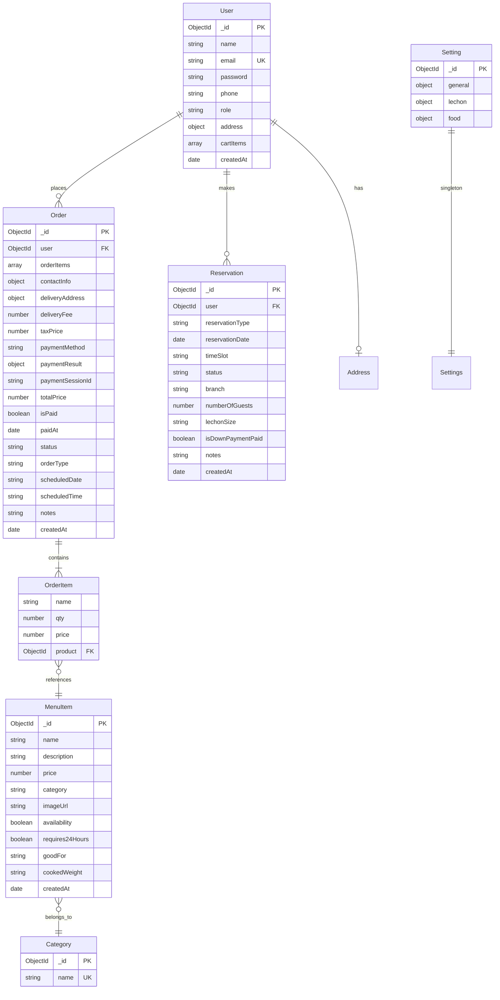

---

## 6. API Reference

Base URL: `http://localhost:8080/api`

### 6.1 Authentication

| Method | Endpoint | Auth | Description | Request Body | Response |
|---|---|---|---|---|---|
| POST | `/auth/register` | Public | Register new customer | `{ name, email, password, phone }` | `{ _id, name, email, phone, role, token }` |
| POST | `/auth/login` | Public | Login | `{ email, password }` | `{ _id, name, email, role, token }` |

### 6.2 Users

| Method | Endpoint | Auth | Description | Request Body | Response |
|---|---|---|---|---|---|
| GET | `/users/profile` | protect | Get current user profile | — | `{ _id, name, email, phone, role, address }` |
| PUT | `/users/profile` | protect | Update profile | `{ name, email, phone, address }` | `{ _id, name, email, phone, address }` |
| POST | `/users/change-email/initiate` | protect | Send OTP for email change | `{ newEmail }` | `{ message }` |
| POST | `/users/change-email/verify` | protect | Verify OTP + complete email change | `{ otp, newEmail }` | `{ message }` |
| GET | `/users/cart` | protect | Get user's cart | — | `[CartItem, ...]` |
| PUT | `/users/cart` | protect | Save cart to server | `{ cartItems }` | `[CartItem, ...]` |
| POST | `/users/forgot-password` | Public | Send reset token via email | `{ email }` | `{ message }` |
| GET | `/users/reset-password/:token` | Public | Validate reset token | — | `{ valid }` |
| PUT | `/users/reset-password/:token` | Public | Set new password | `{ password }` | `{ message }` |
| GET | `/users` | admin | List all users | — | `[User, ...]` |
| PUT | `/users/:id` | admin | Update any user | `{ name, email, phone, role }` | `{ updatedUser }` |
| DELETE | `/users/:id` | admin | Delete user | — | `{ message }` |

### 6.3 Menu Items

| Method | Endpoint | Auth | Description | Request Body | Response |
|---|---|---|---|---|---|
| GET | `/menu` | Public | List all menu items | — | `[MenuItem, ...]` |
| GET | `/menu/:id` | Public | Get single item | — | `MenuItem` |
| POST | `/menu` | Admin/Superadmin | Create item | `{ name, description, price, category, imageUrl?, availability?, goodFor?, cookedWeight? }` | `MenuItem` |
| PUT | `/menu/:id` | Admin/Superadmin | Update item | (partial fields) | `MenuItem` |
| DELETE | `/menu/:id` | Admin/Superadmin | Delete item | — | `{ message }` |

### 6.4 Categories

| Method | Endpoint | Auth | Description | Request Body | Response |
|---|---|---|---|---|---|
| GET | `/categories` | Public | List all categories | — | `[Category, ...]` |
| POST | `/categories` | Admin/Superadmin | Create category | `{ name }` | `Category` |
| PUT | `/categories/:id` | Admin/Superadmin | Update category | `{ name }` | `Category` |
| DELETE | `/categories/:id` | Admin/Superadmin | Delete category | — | `{ message }` |

### 6.5 Orders

| Method | Endpoint | Auth | Description | Request Body | Response |
|---|---|---|---|---|---|
| POST | `/orders` | protect | Create order + checkout session | See §6.5a | `{ order, checkoutUrl? }` |
| GET | `/orders/my-orders` | protect | User's orders | — | `[Order, ...]` |
| GET | `/orders/:id` | protect/user owns | Order detail | — | `Order` |
| PUT | `/orders/:id/cancel` | protect/user owns | Cancel (≥48h before) | — | `Order` |
| PUT | `/orders/:id/verify-payment` | protect | Verify mock payment | — | `{ message, order }` |
| GET | `/orders` | Admin/Superadmin | All orders (filters: ?status=&date=) | — | `[Order, ...]` |
| PUT | `/orders/:id/status` | Admin/Superadmin | Update status | `{ status }` | `Order` |
| PUT | `/orders/:id/pay` | Admin/Superadmin | Manual mark as paid | — | `Order` |

#### 6.5a Create Order Request Body

```json
{
  "orderItems": [
    { "name": "Whole Lechon (Medium)", "qty": 1, "price": 17800, "product": "<MenuItem._id>" }
  ],
  "orderType": "Delivery",
  "totalPrice": 19212.00,
  "contactInfo": { "name": "Juan", "phone": "09123456789", "email": "juan@example.com" },
  "deliveryAddress": {
    "street": "123 Rizal St",
    "barangay": "Barangay 1",
    "city": "Marikina",
    "coordinates": { "lat": 14.630, "lng": 121.140 }
  },
  "scheduledDate": "2026-06-27",
  "scheduledTime": "12:00",
  "notes": "No spicy sauce please",
  "paymentMethod": "GCash",
  "deliveryFee": 150,
  "taxPrice": 1262.00
}
```

### 6.6 Reservations

| Method | Endpoint | Auth | Description | Request Body | Response |
|---|---|---|---|---|---|
| POST | `/reservations` | protect | Create reservation | `{ reservationType, reservationDate, timeSlot, branch, numberOfGuests?, lechonSize?, notes? }` | `Reservation` |
| GET | `/reservations/my-reservations` | protect | User's reservations | — | `[Reservation, ...]` |
| GET | `/reservations/:id` | protect | Single reservation | — | `Reservation` |
| GET | `/reservations` | Admin/Superadmin | All reservations | — | `[Reservation, ...]` |
| PUT | `/reservations/:id/status` | Admin/Superadmin | Update status / mark down payment | `{ status, isDownPaymentPaid? }` | `Reservation` |

### 6.7 Reports

| Method | Endpoint | Auth | Description | Notes |
|---|---|---|---|---|
| GET | `/reports/summary` | Admin/Superadmin | Sales + reservation summaries | Frontend renders Recharts + exports jsPDF |

### 6.8 Settings

| Method | Endpoint | Auth | Description | Notes |
|---|---|---|---|---|
| GET | `/settings` | Public | Get all app settings | Used by checkout to read fees/tax |
| PUT | `/settings` | Admin/Superadmin | Update settings | `{ general: {...}, lechon: {...}, food: {...} }` |

---

## 7. Authentication & Authorization

### 7.1 JWT Flow

```mermaid
sequenceDiagram
    participant C as Client
    participant A as Express API
    participant M as MongoDB

    Note over C,A: Registration
    C->>A: POST /api/auth/register { name, email, password, phone }
    A->>A: validate(email, phone format, password ≥ 6)
    A->>M: User.findOne({ email })
    M-->>A: null (new user)
    A->>M: User.create({ name, email, password, phone })
    Note over A: pre('save') → bcrypt.hash(password, 10)
    A->>A: generateToken(user._id, user.role) → JWT(30d)
    A-->>C: 201 { _id, name, email, phone, role, token }

    Note over C,A: Login
    C->>A: POST /api/auth/login { email, password }
    A->>M: User.findOne({ email })
    M-->>A: user document
    A->>A: user.matchPassword(enteredPassword) → bcrypt.compare
    A->>A: generateToken(id, role)
    A-->>C: 200 { _id, name, email, role, token }

    Note over C,A: Authenticated Request
    C->>A: GET /api/orders/my-orders (Authorization: Bearer <token>)
    A->>A: authMiddleware.protect
    Note over A: jwt.verify(token, JWT_SECRET) → { id, role }
    A->>M: User.findById(id).select('-password')
    M-->>A: user (no password)
    A->>A: req.user = user; next()
    A-->>C: [orders, ...]
```

### 7.2 Authorization Matrix (RBAC)

| Role | Permissions |
|---|---|
| **Customer** (default) | Browse menu, manage cart, place orders, create reservations, view own orders/reservations, update profile |
| **User** | Same as Customer (alias) |
| **Staff** | Same as Customer (extended in future) |
| **Admin** | Customer permissions + CRUD menu/categories, manage all orders, manage all reservations, view reports, manage users, update settings |
| **Superadmin** | Full access (same as Admin, separate for auditing) |

Used in middleware:
- `protect` — extracts JWT from `Authorization: Bearer <token>`, attaches `req.user`, returns 401 if invalid/missing
- `admin` — checks `req.user.role ∈ ['Admin', 'Superadmin']`
- `authorize(...roles)` — checks `req.user.role ∈ roles`

---

## 8. Data Flow Diagrams

### 8.1 Order Placement Flow

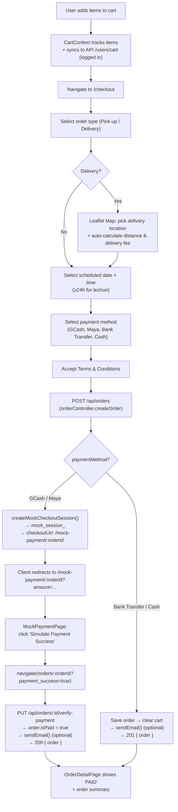

### 8.2 Admin Order Management Flow

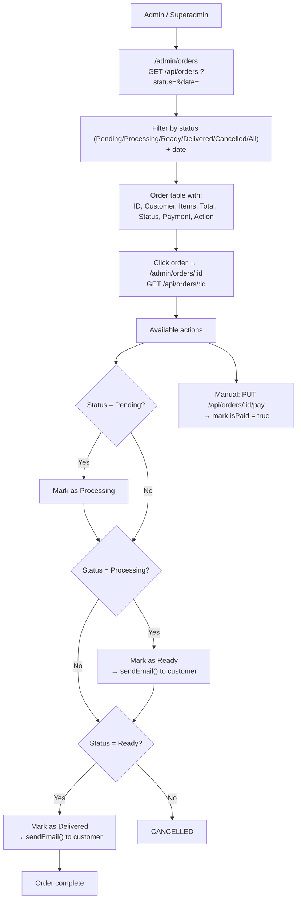

### 8.3 Cart Synchronization (Client ↔ Server)

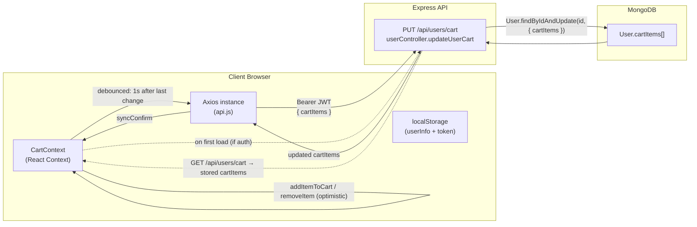

---

## 9. Features

### Customer-facing
- **Browse menu** — Filter by category (Lechon, Main Course, Seafoods, Appetizer)
- **Lechon catalog** — Detailed view with pax capacity (goodFor), weight, 24h lead-time badge
- **Dine-in menu carousel** — Draggable image gallery with zoom modal (Framer Motion)
- **Persistent cart** — Syncs between browser tabs and server for logged-in users
- **Checkout** — Order type (Pick-up/Delivery), interactive map for delivery location, distance-based fee calculation, scheduled date/time validation (≥24h for lechon), multiple payment methods
- **Mock payment** — Simulated GCash/Maya checkout for portfolio demonstration
- **Order tracking** — Status stepper (Pending → Processing → Ready → Delivered), payment verification
- **User profile** — Update name/email/phone, change email with OTP, password reset
- **Reservations** — Book dine-in tables or reserve lechon with down payment tracking

### Admin dashboard
- **Dashboard** — Sales metrics, order/revenue counts, recent orders (Recharts)
- **Order management** — Filterable order list, status progression (Pending → Processing → Ready → Delivered), manual payment marking, cancellation
- **Menu management** — CRUD menu items + categories, image upload via FileReader (base64), 24h toggle, availability toggle
- **Lechon management** — Separate CRUD for lechon catalog with sizing fields
- **User management** — List, edit roles, delete users
- **Reports** — Sales summary with date-range filtering, PDF export (jsPDF + AutoTable)
- **Settings** — Tax rate, delivery fees (lechon vs food), free delivery threshold, store location on map, operating hours, terms & conditions, announcement popup

### Cross-cutting
- **Responsive** — Mobile hamburger drawer, touch-friendly buttons (min 48px), responsive font sizes (MUI)
- **Loading states** — Global overlay + branded spinner (LechonSpinner)
- **Notifications** — Toast notifications (success/error/info)
- **Modals** — Global confirmation dialogs (logout, admin navigation, terms, privacy policy)
- **Accessibility** — Semantic landmarks, skip-to-content, keyboard navigation, visible focus rings, aria-live notifications (see §13)

---

## 10. Quick Start

### Prerequisites
- **Node.js** ≥ 18
- **MongoDB** — either local installation or [MongoDB Atlas](https://www.mongodb.com/atlas/database) free tier (M0, 512 MB)
- npm (bundled with Node.js)

### Setup

```bash
# 1. Clone the repository
git clone <repo-url> && cd lechon-ordering-app

# 2. Install all dependencies (client + server)
npm run install:all

# 3. Configure environment variables
#    Copy the example files and edit as needed:
cp client/.env.example client/.env
cp server/.env.example server/.env

# 4. (Optional) Start MongoDB locally or set MONGODB_URI in server/.env to your Atlas SRV

# 5. Seed the database with sample menu items
npm run seed

# 6. Start both servers in development mode
npm run dev
```

The app will be available at:
- **Frontend:** http://localhost:3000
- **Backend API:** http://localhost:8080

### Demo Admin Credentials

After seeding, log in with:
- **Email:** `admin@crispylechonhouse.example`
- **Password:** `password123`

> These are demo-only credentials. Change them for any production use.

### Available Scripts (root `package.json`)

| Script | Description |
|---|---|
| `npm run install:all` | Install dependencies for both client and server |
| `npm run dev` | Run client (port 3000) + server (port 8080) concurrently |
| `npm run build:client` | Build React app to `client/build/` |
| `npm run start:server` | Start Express server in production mode |
| `npm run seed` | Seed MongoDB with sample lechon + menu items |
| `npm run seed:destroy` | Clear all menu items from the database |

---

## 11. Environment Variables

### Server (`server/.env`)

| Variable | Required? | Default | Description |
|---|---|---|---|
| `PORT` | No | `8080` | Express server port |
| `NODE_ENV` | No | `development` | Environment (`development` / `production`) |
| `CLIENT_URL` | No | `http://localhost:3000` | Allowed CORS origin (if unset, only localhost:3000 is allowed) |
| `MONGODB_URI` | **Yes** | `mongodb://localhost:27017/lechon_app` | MongoDB connection string (local or Atlas SRV) |
| `JWT_SECRET` | **Yes** | (none) | Secret key for JWT signing. Use a long random string |
| `EMAIL_USER` | No | (none) | Gmail address for sending order/password-reset emails. If blank, emails are logged to console (demo mode) |
| `EMAIL_PASS` | No | (none) | Gmail app password (requires 2FA). Only used if `EMAIL_USER` is set |

### Client (`client/.env`)

| Variable | Required? | Default | Description |
|---|---|---|---|
| `REACT_APP_API_URL` | No | `http://localhost:8080` | Backend API base URL. Set to your deployed API URL in production |

---

## 12. Deployment

### Frontend (Static SPA)

Deploy the static build from `client/build/` to any static host:

**Netlify** (recommended):
1. Connect your Git repo to Netlify.
2. Build command: `npm run build:client`
3. Publish directory: `client/build`
4. The existing `client/public/_redirects` file handles SPA routing (`/* /index.html 200`).

**Vercel** (alternative):
1. Root directory: `client`
2. Build command: `npm run build`
3. Output directory: `build`
4. Add rewrite rule: "Source: `/(.*)`, Destination: `/index.html`"

### Backend (Node.js API)

Deploy the `server/` directory to a Node.js host:

**Render** (recommended):
1. Create a new **Web Service**.
2. Root directory: `server`
3. Build command: `npm install`
4. Start command: `npm start`
5. Add environment variables from `server/.env.example` (the required ones).

**Railway** (alternative):
1. Root directory: `server`
2. Deploy via railway CLI or GitHub integration.
3. Set environment variables under the service settings.

### Database

**MongoDB Atlas** (free M0 tier):
1. Create a free cluster at [cloud.mongodb.com](https://cloud.mongodb.com).
2. Create a database user (password-based).
3. In Network Access, allow `0.0.0.0/0` or add your backend's IP.
4. Copy the SRV connection string → set as `MONGODB_URI` in the backend env.

---

## 13. Accessibility

This project targets **WCAG 2.1 Level AA** compliance on customer-facing pages.

### Implemented / Planned

| Area | Measures |
|---|---|
| Landmarks | `<header>`, `<nav aria-label="Main">`, `<main id="main">`, `<footer>` |
| Skip link | "Skip to main content" link as first focusable element on every page |
| Color contrast | All text/background pairs ≥ 4.5:1 (AA). Colors centralized in MUI theme (no hardcoded hex values). Roasted Amber `#B45309` on white = 5.9:1 ✓ |
| Keyboard | All interactive elements focusable and operable with keyboard; visible `:focus-visible` ring (3px outline). Dine-in carousel has prev/next buttons + arrow keys. Dialogs/Drawers trap focus and return focus on close |
| Images | `alt` text on meaningful images (menu items); decorative/background images use `alt=""` + `aria-hidden="true"`. On-brand `<PlaceholderImage/>` component for missing images |
| Forms | Every input has a `<label>` or `aria-labelledby`; required fields annotated with `aria-required`; errors linked via `aria-invalid` + `aria-describedby`; success/error feedback announced via `aria-live` regions |
| Reduced motion | Framer Motion animations respect `prefers-reduced-motion: reduce` media query |
| Touch targets | Buttons min 48px height on mobile (configurable in MUI theme) |
| Screen reader | Semantic HTML + ARIA. Tested with NVDA / VoiceOver |
| Auto test | `axe-core` integration (test runner or browser extension) — target: 0 critical + 0 serious violations |

---

## 14. Screenshots

### Customer Pages

**Home Page**
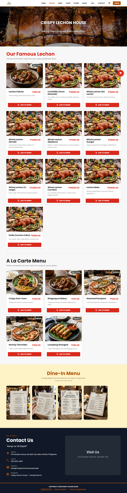

**Menu Page**
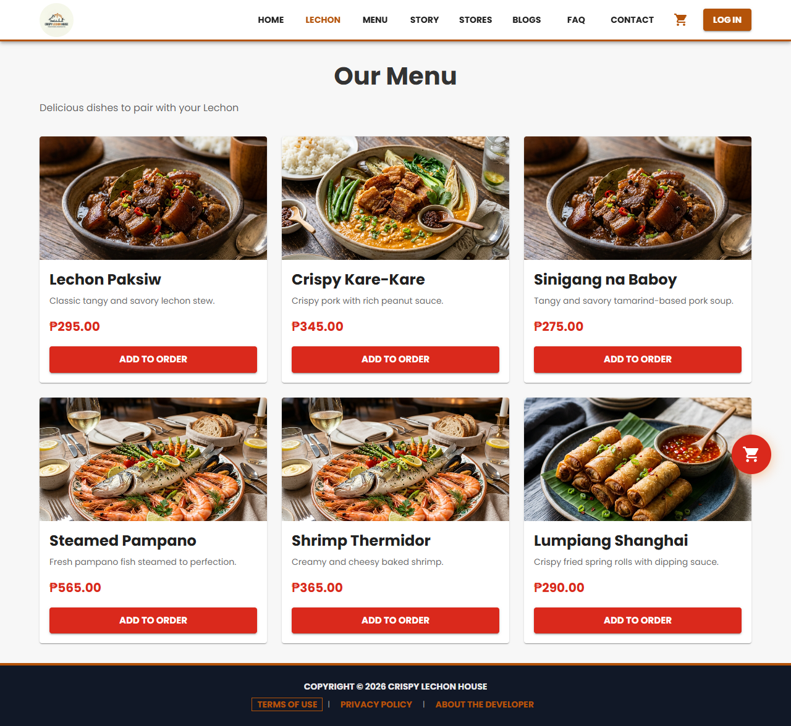

**Lechon Page**
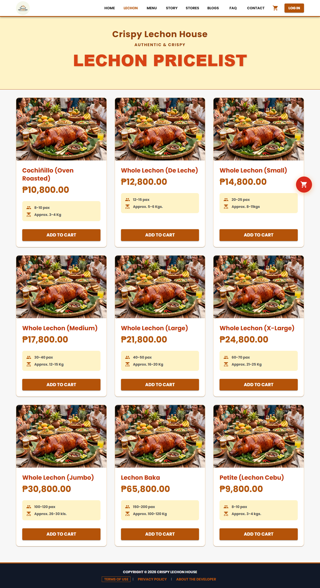

**FAQ Page**
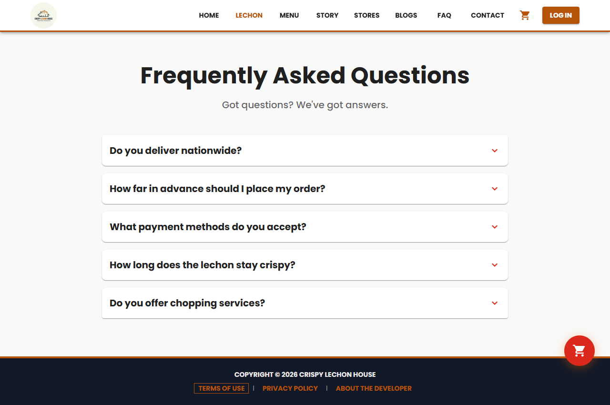

### Admin Pages

**Dashboard**
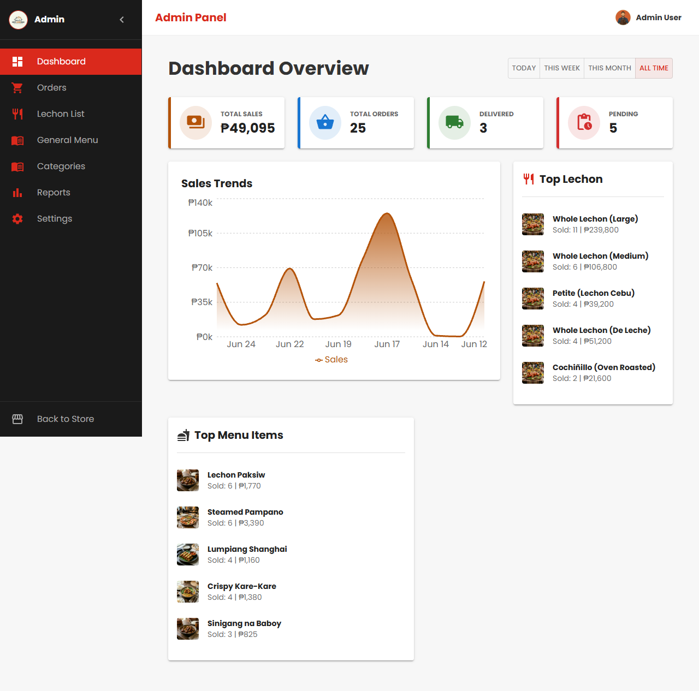

**Orders**
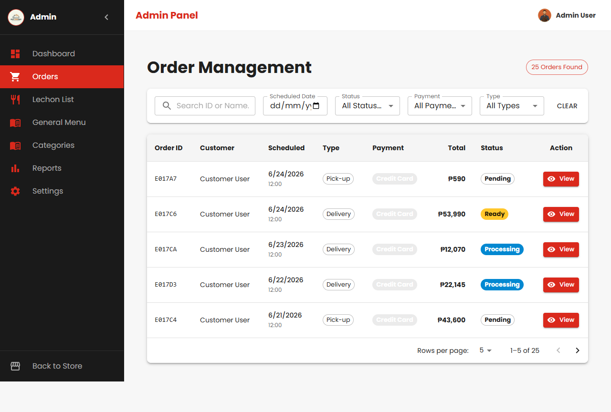

**Menu**
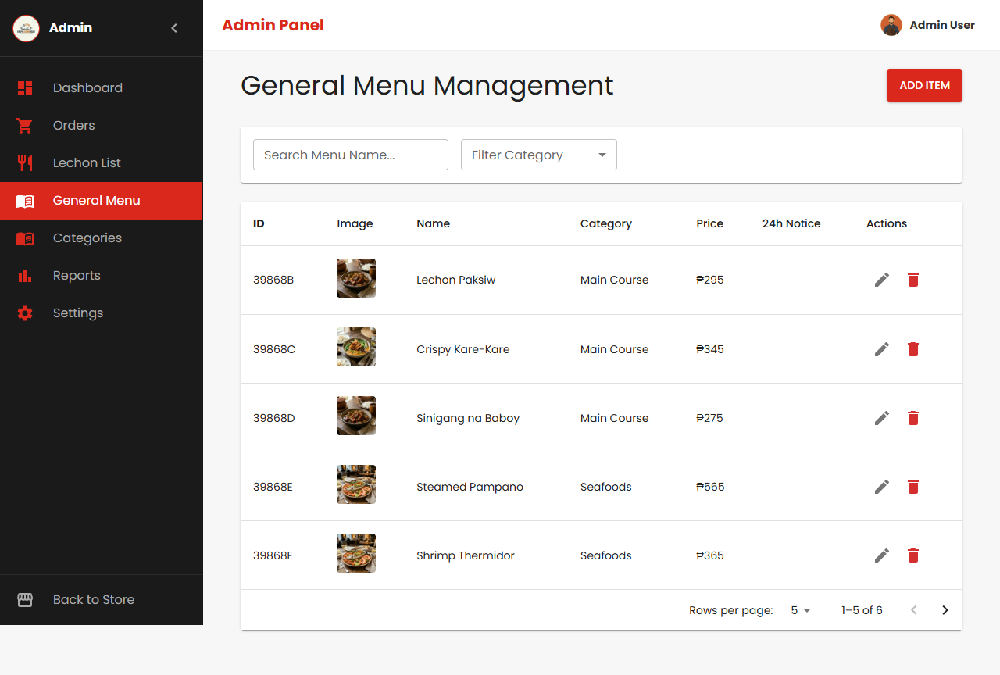

**Users**
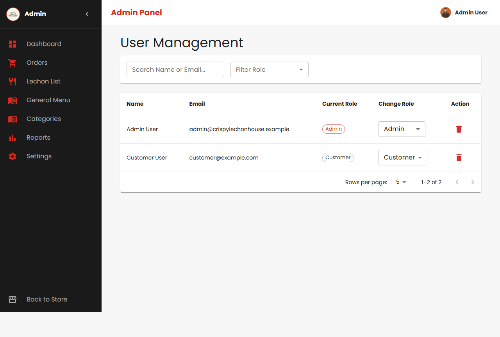

**Reports**
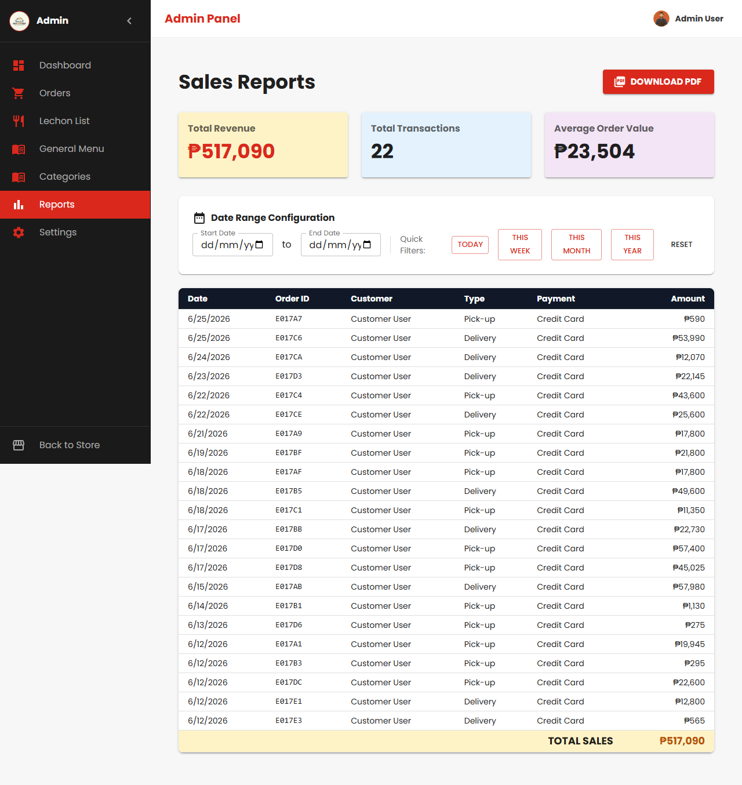

**Settings**
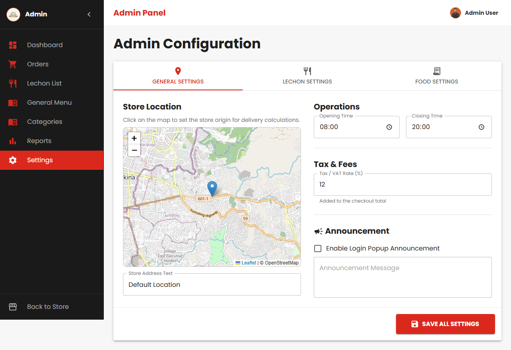


---

## 15. Testing

```bash
# Frontend tests (react-scripts + jest)
cd client
npm test

# Backend: manual API testing via curl or Postman
# No automated backend tests are configured yet.
```

### Manual Test Checklist

- [ ] Register a new customer → verify JWT token returned → stored in localStorage
- [ ] Browse menu (all categories visible, images load or show placeholder)
- [ ] Add lechon to cart → see cart badge update → open cart drawer → verify item
- [ ] Proceed to checkout → select delivery → pick location on map → see fee calculation
- [ ] Place order with GCash → redirected to MockPaymentPage → simulate success → verified
- [ ] Login as admin → access admin dashboard → verify metrics load
- [ ] Update order status (Pending → Processing → Ready → Delivered)
- [ ] Export PDF report from Reports page
- [ ] Test responsive layout on mobile viewport (375px width)
- [ ] Keyboard-tab through Home, Lechon, Checkout pages without mouse

---

*Built with React 19, Express 5, MongoDB, and Material-UI 5. Portfolio demonstration — fictional brand, placeholder assets, simulated payments.*
